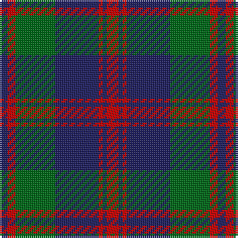

The parent of this is [Robertson of Struan 1816](/tartans/db/4/r4/g20/db22/r2/db2/r/6/)

This was sourced from register-of-tartans.  It is a [7 stripes tartan](/stripes/stripes7/).

Original link https://www.tartanregister.gov.uk/tartanDetails.aspx?ref=3536

## Thread count
DB/4 R4 G20 DB22 R2 DB2 R/6

## Palette
Each colour and its ΔE from the base-6 reference it is a variant of.

| Colour | Shade | Base | ΔE (OKLab) |
|---|---|---|---|
| DB |  `#202060` | B  | 0.11 |
| DG |  `#003820` | G  | 0.16 |
| G |  `#006818` | G  | 0.02 |
| R |  `#C80000` | R  | 0.00 |

# Sample pattern

ID: /variants/db/4/r4/g20/db22/r2/db2/r/6-db202060-dg003820-g006818-rc80000/
