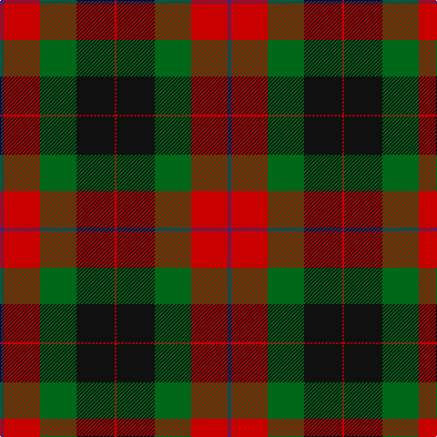

The parent of this is [Skene of Cromar Clan Tartan Tartan Number: 535. Earliest known date: pre 2003 Count divided by 2 for display purposes. See products available Copyright © Blair Urquhart, Comrie, 2015](/tartans/db/4/r40/g40/k42/r/2/)

This was sourced from house-of-tartan.  It is a [5 stripes tartan](/stripes/stripes5/).

Original link http://www.house-of-tartan.scotland.net/house/TartanViewjs.asp?colr=Def&tnam=535

## Thread count
DB/4 R40 G40 K42 R/2

## Palette
Each colour and its ΔE from the base-6 reference it is a variant of.

| Colour | Shade | Base | ΔE (OKLab) |
|---|---|---|---|
| DB |  `#2C2C80` | B  | 0.05 |
| G |  `#006818` | G  | 0.02 |
| K |  `#101010` | K  | 0.17 |
| R |  `#C80000` | R  | 0.00 |

# Sample pattern

ID: /variants/db/4/r40/g40/k42/r/2-db2c2c80-g006818-k101010-rc80000/
