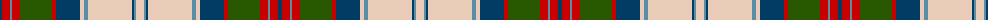

The parent of this is [MacGillivray Dress, Janice (Personal](/tartans/db/4/r8/b2/r8/g32/r4/db24/lr4/b4/lr44/db2/b2/lr/8/)

This was sourced from tartans-authority.  It is a [13 stripes tartan](/stripes/stripes13/).

Original link http://www.tartansauthority.com/tartan-ferret/display/10811/

## Thread count
DB/4 R8 B2 R8 G32 R4 DB24 LR4 B4 LR44 DB2 B2 LR/8

## Palette
Each colour and its ΔE from the base-6 reference it is a variant of.

| Colour | Shade | Base | ΔE (OKLab) |
|---|---|---|---|
| B |  `#5C8CA8` | B  | 0.23 |
| DB |  `#003C64` | B  | 0.07 |
| G |  `#285800` | G  | 0.04 |
| LR |  `#E8CCB8` | W  | 0.11 |
| R |  `#C80000` | R  | 0.00 |

ID: /variants/db/4/r8/b2/r8/g32/r4/db24/lr4/b4/lr44/db2/b2/lr/8-b5c8ca8-db003c64-g285800-lre8ccb8-rc80000/
