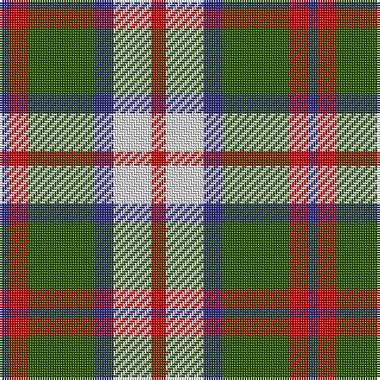

The parent of this is [MacKintosh Dress - 1930 (Clan?)](/tartans/db/4/r8/g28/db8/ln16/r/6/)

This was sourced from tartans-authority.  It is a [6 stripes tartan](/stripes/stripes6/).

Original link http://www.tartansauthority.com/tartan-ferret/display/538/

## Thread count
DB/4 R8 G28 DB8 LN16 R/6

## Palette
Each colour and its ΔE from the base-6 reference it is a variant of.

| Colour | Shade | Base | ΔE (OKLab) |
|---|---|---|---|
| DB |  `#2C2C80` | B  | 0.05 |
| G |  `#285800` | G  | 0.04 |
| LN |  `#E0E0E0` | W  | 0.06 |
| R |  `#C80000` | R  | 0.00 |

# Sample pattern

ID: /variants/db/4/r8/g28/db8/ln16/r/6-db2c2c80-g285800-lne0e0e0-rc80000/
