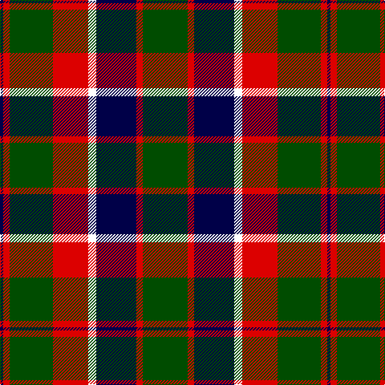

The parent of this is [New Glasgow (Canada)](/tartans/db/4/r8/g54/r44/w10/db50/r8/g/56/)

This was sourced from register-of-tartans.  It is a [8 stripes tartan](/stripes/stripes8/).

Original link https://www.tartanregister.gov.uk/tartanDetails.aspx?ref=11166

## Thread count
DB/4 R8 G54 R44 W10 DB50 R8 G/56

## Palette
Each colour and its ΔE from the base-6 reference it is a variant of.

| Colour | Shade | Base | ΔE (OKLab) |
|---|---|---|---|
| DB |  `#000048` | B  | 0.21 |
| G |  `#004C00` | G  | 0.08 |
| R |  `#DC0000` | R  | 0.04 |
| W |  `#FFFFFF` | W  | 0.03 |

# Sample pattern

ID: /variants/db/4/r8/g54/r44/w10/db50/r8/g/56-db000048-g004c00-rdc0000-wffffff/
