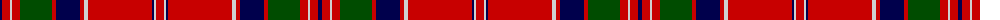

The parent of this is [MacGillivray](/tartans/db/4/r8/n2/r8/g32/r4/db24/r4/n4/r64/db2/n2/r/8/)

This was sourced from weddslist.  It is a [13 stripes tartan](/stripes/stripes13/).

Original link http://www.weddslist.com/cgi-bin/tartans/pg.pl?source=rb

## Thread count
DB/4 R8 N2 R8 G32 R4 DB24 R4 N4 R64 DB2 N2 R/8

## Palette
Each colour and its ΔE from the base-6 reference it is a variant of.

| Colour | Shade | Base | ΔE (OKLab) |
|---|---|---|---|
| DB |  `#00004C` | B  | 0.21 |
| G |  `#004C00` | G  | 0.08 |
| N |  `#D0D0D0` | W  | 0.11 |
| R |  `#C80000` | R  | 0.00 |

ID: /variants/db/4/r8/n2/r8/g32/r4/db24/r4/n4/r64/db2/n2/r/8-db00004c-g004c00-nd0d0d0-rc80000/
