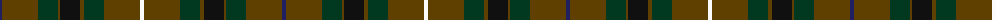

The parent of this is [Duchess of York (Fashion)](/tartans/db/4/t36/dg20/t2/k20/t4/dg20/t36/w/4/)

This was sourced from tartans-authority.  It is a [9 stripes tartan](/stripes/stripes9/).

Original link http://www.tartansauthority.com/tartan-ferret/display/607/

## Thread count
DB/4 T36 DG20 T2 K20 T4 DG20 T36 W/4

## Palette
Each colour and its ΔE from the base-6 reference it is a variant of.

| Colour | Shade | Base | ΔE (OKLab) |
|---|---|---|---|
| DB |  `#202060` | B  | 0.11 |
| DG |  `#003820` | G  | 0.16 |
| K |  `#101010` | K  | 0.17 |
| T |  `#604000` | G  | 0.14 |
| W |  `#FCFCFC` | W  | 0.03 |

ID: /variants/db/4/t36/dg20/t2/k20/t4/dg20/t36/w/4-db202060-dg003820-k101010-t604000-wfcfcfc/
