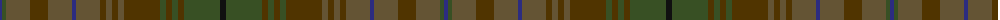

The parent of this is [Van Ingelgem Htg (Personal)](/tartans/db/4/ta4/g24/t18/g24/db4/g24/t6/g6/t6/g6/t36/ta6/t6/ta6/t6/ta36/k/6/)

This was sourced from tartans-authority.  It is a [18 stripes tartan](/stripes/stripes18/).

Original link http://www.tartansauthority.com/tartan-ferret/display/7798/

## Thread count
DB/4 Ta4 G24 T18 G24 DB4 G24 T6 G6 T6 G6 T36 Ta6 T6 Ta6 T6 Ta36 K/6

## Palette
Each colour and its ΔE from the base-6 reference it is a variant of.

| Colour | Shade | Base | ΔE (OKLab) |
|---|---|---|---|
| DB |  `#2C2C80` | B  | 0.05 |
| G |  `#645434` | G  | 0.13 |
| K |  `#101010` | K  | 0.17 |
| T |  `#503400` | G  | 0.16 |
| Ta |  `#385024` | G  | 0.08 |

ID: /variants/db/4/ta4/g24/t18/g24/db4/g24/t6/g6/t6/g6/t36/ta6/t6/ta6/t6/ta36/k/6-db2c2c80-g645434-k101010-t503400-ta385024/
