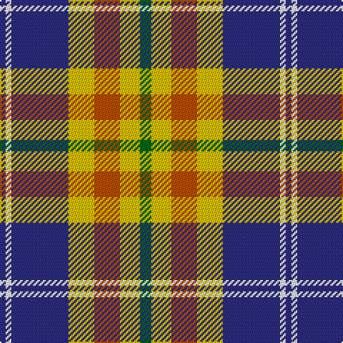

The parent of this is [Tombow 140th Anniversary, The](/tartans/db/4/w4/db40/y18/do18/y14/g/8/)

This was sourced from tartans-authority.  It is a [7 stripes tartan](/stripes/stripes7/).

Original link http://www.tartansauthority.com/tartan-ferret/display/11220/

## Thread count
DB/4 W4 DB40 Y18 DO18 Y14 G/8

## Palette
Each colour and its ΔE from the base-6 reference it is a variant of.

| Colour | Shade | Base | ΔE (OKLab) |
|---|---|---|---|
| DB |  `#2C2C80` | B  | 0.05 |
| DO |  `#B84C00` | R  | 0.08 |
| G |  `#006818` | G  | 0.02 |
| W |  `#FCFCFC` | W  | 0.03 |
| Y |  `#E8C000` | Y  | 0.00 |

# Sample pattern

ID: /variants/db/4/w4/db40/y18/do18/y14/g/8-db2c2c80-dob84c00-g006818-wfcfcfc-ye8c000/
