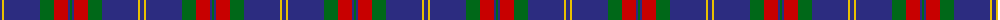

The parent of this is [Unnamed C20th - USA](/tartans/db/4/y2/db36/g14/r14/db2/g/2/)

This was sourced from tartans-authority.  It is a [7 stripes tartan](/stripes/stripes7/).

Original link http://www.tartansauthority.com/tartan-ferret/display/8745/

## Thread count
DB/4 Y2 DB36 G14 R14 DB2 G/2

## Palette
Each colour and its ΔE from the base-6 reference it is a variant of.

| Colour | Shade | Base | ΔE (OKLab) |
|---|---|---|---|
| DB |  `#2C2C80` | B  | 0.05 |
| G |  `#006818` | G  | 0.02 |
| R |  `#C80000` | R  | 0.00 |
| Y |  `#E8C000` | Y  | 0.00 |

# Sample pattern

ID: /variants/db/4/y2/db36/g14/r14/db2/g/2-db2c2c80-g006818-rc80000-ye8c000/
