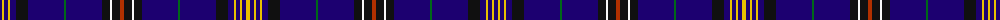

The parent of this is [Wupper](/tartans/db/4/y2/db4/y2/db6/k12/db36/g2/db36/k8/w2/k8/r4/k8/w2/k8/db36/g2/db36/k12/db6/y2/db4/y2/db4/y/4/)

This was sourced from register-of-tartans.  It is a [26 stripes tartan](/stripes/stripes26/).

Original link https://www.tartanregister.gov.uk/tartanDetails.aspx?ref=4786

## Thread count
DB/4 Y2 DB4 Y2 DB6 K12 DB36 G2 DB36 K8 W2 K8 R4 K8 W2 K8 DB36 G2 DB36 K12 DB6 Y2 DB4 Y2 DB4 Y/4

## Palette
Each colour and its ΔE from the base-6 reference it is a variant of.

| Colour | Shade | Base | ΔE (OKLab) |
|---|---|---|---|
| DB |  `#1C0070` | B  | 0.14 |
| G |  `#006818` | G  | 0.02 |
| K |  `#101010` | K  | 0.17 |
| R |  `#B03000` | R  | 0.05 |
| W |  `#F8F8F8` | W  | 0.01 |
| Y |  `#E8C000` | Y  | 0.00 |

ID: /variants/db/4/y2/db4/y2/db6/k12/db36/g2/db36/k8/w2/k8/r4/k8/w2/k8/db36/g2/db36/k12/db6/y2/db4/y2/db4/y/4-db1c0070-g006818-k101010-rb03000-wf8f8f8-ye8c000/
