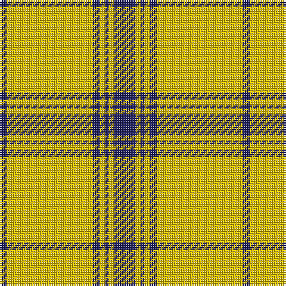

The parent of this is [Morris (Welsh Name)](/tartans/db/4/y48/db4/y3/db2/y3/db3/dba/6/)

This was sourced from tartans-authority.  It is a [8 stripes tartan](/stripes/stripes8/).

Original link http://www.tartansauthority.com/tartan-ferret/display/5749/

## Thread count
DB/4 Y48 DB4 Y3 DB2 Y3 DB3 DBa/6

## Palette
Each colour and its ΔE from the base-6 reference it is a variant of.

| Colour | Shade | Base | ΔE (OKLab) |
|---|---|---|---|
| DB |  `#202060` | B  | 0.11 |
| DBa |  `#202060` | B  | 0.11 |
| Y |  `#E8C000` | Y  | 0.00 |

# Sample pattern

ID: /variants/db/4/y48/db4/y3/db2/y3/db3/dba/6-db202060-dba202060-ye8c000/
