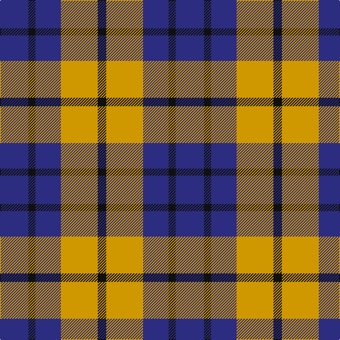

The parent of this is [Johore Regiment (Military)](/tartans/db/40/k10/db36/dy52/k/12/)

This was sourced from tartans-authority.  It is a [5 stripes tartan](/stripes/stripes5/).

Original link http://www.tartansauthority.com/tartan-ferret/display/260/

## Thread count
DB/40 K10 DB36 DY52 K/12

## Palette
Each colour and its ΔE from the base-6 reference it is a variant of.

| Colour | Shade | Base | ΔE (OKLab) |
|---|---|---|---|
| DB |  `#2C2C80` | B  | 0.05 |
| DY |  `#D09800` | Y  | 0.11 |
| K |  `#101010` | K  | 0.17 |

# Sample pattern

ID: /variants/db/40/k10/db36/dy52/k/12-db2c2c80-dyd09800-k101010/
