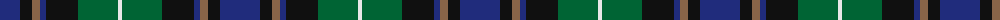

The parent of this is [Deloughery, Paul Name Tartan Tartan Number: 10658. Earliest known date: 09/07/2012 Registration notes: Created by the designer for his family. Colours: saffron, green and blue represent their Irish heritage. See products available Copyright © Blair Urquhart, Comrie, 2015](/tartans/db/40/k12/lt8/db6/k32/g40/ln/4/)

This was sourced from house-of-tartan.  It is a [7 stripes tartan](/stripes/stripes7/).

Original link http://www.house-of-tartan.scotland.net/house/TartanViewjs.asp?colr=Def&tnam=10658

## Thread count
DB/40 K12 LT8 DB6 K32 G40 LN/4

## Palette
Each colour and its ΔE from the base-6 reference it is a variant of.

| Colour | Shade | Base | ΔE (OKLab) |
|---|---|---|---|
| DB |  `#202C7C` | B  | 0.06 |
| G |  `#006434` | G  | 0.04 |
| K |  `#101010` | K  | 0.17 |
| LN |  `#E8E8E8` | W  | 0.04 |
| LT |  `#886448` | R  | 0.16 |

# Sample pattern

ID: /variants/db/40/k12/lt8/db6/k32/g40/ln/4-db202c7c-g006434-k101010-lne8e8e8-lt886448/
