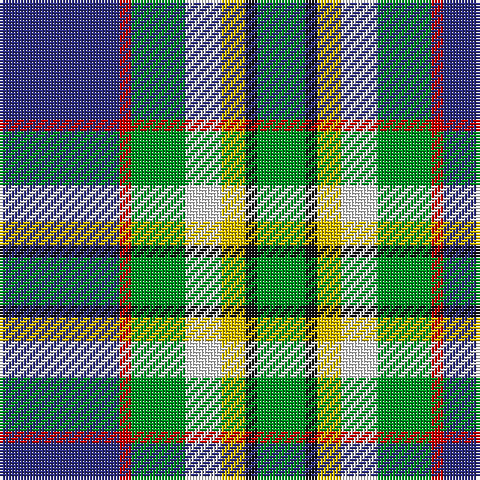

The parent of this is [Crofters (Corporate?)](/tartans/db/40/r4/g18/w12/y8/k4/g/16/)

This was sourced from tartans-authority.  It is a [7 stripes tartan](/stripes/stripes7/).

Original link http://www.tartansauthority.com/tartan-ferret/display/7068/

## Thread count
DB/40 R4 G18 W12 Y8 K4 G/16

## Palette
Each colour and its ΔE from the base-6 reference it is a variant of.

| Colour | Shade | Base | ΔE (OKLab) |
|---|---|---|---|
| DB |  `#2C2C80` | B  | 0.05 |
| G |  `#009420` | G  | 0.15 |
| K |  `#101010` | K  | 0.17 |
| R |  `#C80000` | R  | 0.00 |
| W |  `#F8F8F8` | W  | 0.01 |
| Y |  `#E8C000` | Y  | 0.00 |

# Sample pattern

ID: /variants/db/40/r4/g18/w12/y8/k4/g/16-db2c2c80-g009420-k101010-rc80000-wf8f8f8-ye8c000/
