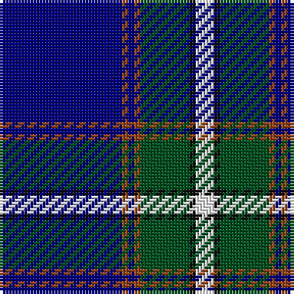

The parent of this is [Chestico](/tartans/db/40/t2/db2/t2/g16/k2/w/6/)

This was sourced from register-of-tartans.  It is a [7 stripes tartan](/stripes/stripes7/).

Original link https://www.tartanregister.gov.uk/tartanDetails.aspx?ref=10867

## Thread count
DB/40 T2 DB2 T2 G16 K2 W/6

## Palette
Each colour and its ΔE from the base-6 reference it is a variant of.

| Colour | Shade | Base | ΔE (OKLab) |
|---|---|---|---|
| DB |  `#000080` | B  | 0.14 |
| G |  `#005020` | G  | 0.08 |
| K |  `#101010` | K  | 0.17 |
| T |  `#98481C` | R  | 0.11 |
| W |  `#FFFFFF` | W  | 0.03 |

# Sample pattern

ID: /variants/db/40/t2/db2/t2/g16/k2/w/6-db000080-g005020-k101010-t98481c-wffffff/
