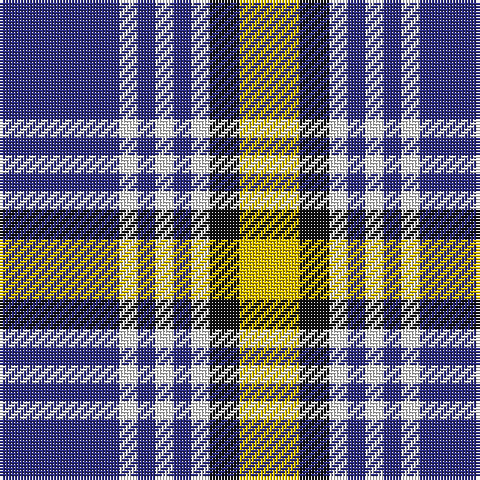

The parent of this is [Kile (No red line) (Personal)](/tartans/db/40/w6/db6/w6/db6/w6/k10/y/20/)

This was sourced from tartans-authority.  It is a [8 stripes tartan](/stripes/stripes8/).

Original link http://www.tartansauthority.com/tartan-ferret/display/1320/

## Thread count
DB/40 W6 DB6 W6 DB6 W6 K10 Y/20

## Palette
Each colour and its ΔE from the base-6 reference it is a variant of.

| Colour | Shade | Base | ΔE (OKLab) |
|---|---|---|---|
| DB |  `#2C2C80` | B  | 0.05 |
| K |  `#101010` | K  | 0.17 |
| W |  `#FCFCFC` | W  | 0.03 |
| Y |  `#E8C000` | Y  | 0.00 |

# Sample pattern

ID: /variants/db/40/w6/db6/w6/db6/w6/k10/y/20-db2c2c80-k101010-wfcfcfc-ye8c000/
