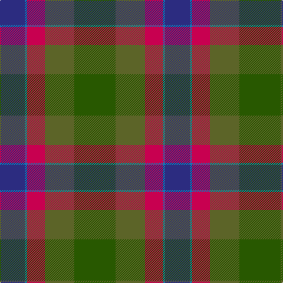

The parent of this is [Dunanas Rising (Corporate)](/tartans/db/42/b4/r30/g50/ga/70/)

This was sourced from tartans-authority.  It is a [5 stripes tartan](/stripes/stripes5/).

Original link http://www.tartansauthority.com/tartan-ferret/display/10821/

## Thread count
DB/42 B4 R30 G50 Ga/70

## Palette
Each colour and its ΔE from the base-6 reference it is a variant of.

| Colour | Shade | Base | ΔE (OKLab) |
|---|---|---|---|
| B |  `#1474B4` | B  | 0.15 |
| DB |  `#2C2C80` | B  | 0.05 |
| G |  `#5C6428` | G  | 0.09 |
| Ga |  `#285800` | G  | 0.04 |
| R |  `#C80050` | R  | 0.07 |

# Sample pattern

ID: /variants/db/42/b4/r30/g50/ga/70-b1474b4-db2c2c80-g5c6428-ga285800-rc80050/
