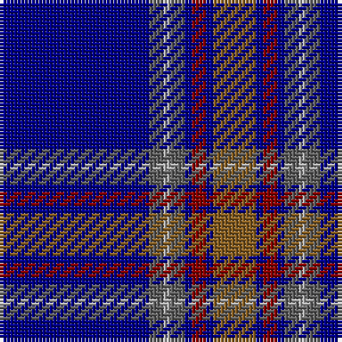

The parent of this is [Blue Rust (Corporate)](/tartans/db/42/n4/na2/n4/db2/dr4/db2/lt/12/)

This was sourced from tartans-authority.  It is a [8 stripes tartan](/stripes/stripes8/).

Original link http://www.tartansauthority.com/tartan-ferret/display/3709/

## Thread count
DB/42 N4 Na2 N4 DB2 DR4 DB2 LT/12

## Palette
Each colour and its ΔE from the base-6 reference it is a variant of.

| Colour | Shade | Base | ΔE (OKLab) |
|---|---|---|---|
| DB |  `#000088` | B  | 0.14 |
| DR |  `#880000` | R  | 0.14 |
| LT |  `#886024` | R  | 0.16 |
| N |  `#606060` | B  | 0.15 |
| Na |  `#ACACAC` | Y  | 0.18 |

# Sample pattern

ID: /variants/db/42/n4/na2/n4/db2/dr4/db2/lt/12-db000088-dr880000-lt886024-n606060-naacacac/
