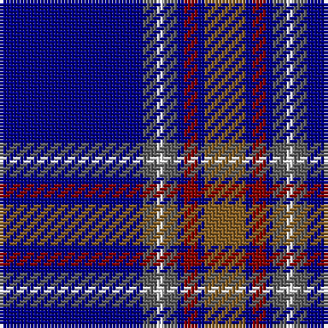

The parent of this is [Blue Rust](/tartans/db/42/n4/w2/n4/db2/dr4/db2/lt/12/)

This was sourced from register-of-tartans.  It is a [8 stripes tartan](/stripes/stripes8/).

Original link https://www.tartanregister.gov.uk/tartanDetails.aspx?ref=5392

## Thread count
DB/42 N4 W2 N4 DB2 DR4 DB2 LT/12

## Palette
Each colour and its ΔE from the base-6 reference it is a variant of.

| Colour | Shade | Base | ΔE (OKLab) |
|---|---|---|---|
| DB |  `#000088` | B  | 0.14 |
| DR |  `#880000` | R  | 0.14 |
| LT |  `#886024` | R  | 0.16 |
| N |  `#606060` | B  | 0.15 |
| W |  `#FFFFFF` | W  | 0.03 |

# Sample pattern

ID: /variants/db/42/n4/w2/n4/db2/dr4/db2/lt/12-db000088-dr880000-lt886024-n606060-wffffff/
