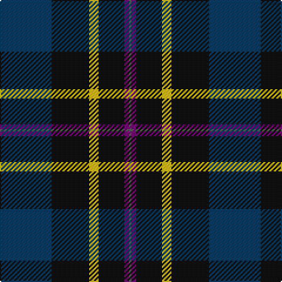

The parent of this is [Martinez, Clément (Personal)](/tartans/db/44/k32/y8/k22/p4/n/2/)

This was sourced from register-of-tartans.  It is a [6 stripes tartan](/stripes/stripes6/).

Original link https://www.tartanregister.gov.uk/tartanDetails.aspx?ref=11580

## Thread count
DB/44 K32 Y8 K22 P4 N/2

## Palette
Each colour and its ΔE from the base-6 reference it is a variant of.

| Colour | Shade | Base | ΔE (OKLab) |
|---|---|---|---|
| DB |  `#003C64` | B  | 0.07 |
| K |  `#101010` | K  | 0.17 |
| N |  `#5C5C5C` | B  | 0.14 |
| P |  `#780078` | B  | 0.16 |
| Y |  `#E8C000` | Y  | 0.00 |

# Sample pattern

ID: /variants/db/44/k32/y8/k22/p4/n/2-db003c64-k101010-n5c5c5c-p780078-ye8c000/
