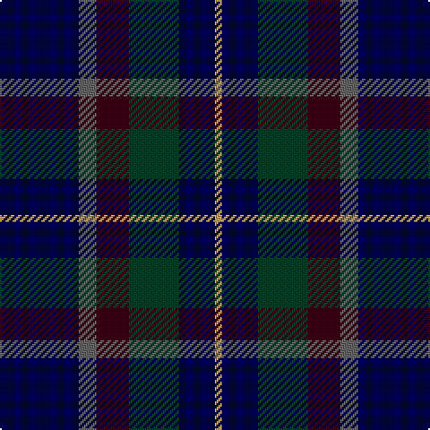

The parent of this is [Belfrage (Name)](/tartans/db/44/n10/dr18/dg28/db20/o/4/)

This was sourced from tartans-authority.  It is a [6 stripes tartan](/stripes/stripes6/).

Original link http://www.tartansauthority.com/tartan-ferret/display/3672/

## Thread count
DB/44 N10 DR18 DG28 DB20 O/4

## Palette
Each colour and its ΔE from the base-6 reference it is a variant of.

| Colour | Shade | Base | ΔE (OKLab) |
|---|---|---|---|
| DB |  `#000048` | B  | 0.21 |
| DG |  `#004028` | G  | 0.14 |
| DR |  `#3C0014` | B  | 0.23 |
| N |  `#646464` | B  | 0.16 |
| O |  `#C8A050` | Y  | 0.11 |

# Sample pattern

ID: /variants/db/44/n10/dr18/dg28/db20/o/4-db000048-dg004028-dr3c0014-n646464-oc8a050/
