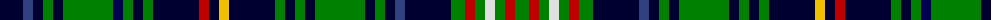

The parent of this is [Franconian](/tartans/db/46/b10/db10/g10/db10/g50/dba10/g10/db10/g10/db46/r10/db10/y10/db46/g10/db10/g10/db10/g50/db10/g10/db10/b10/db46/g14/r10/g10/ln10/g10/r10/g/14/)

This was sourced from weddslist.  It is a [32 stripes tartan](/stripes/stripes32/).

Original link http://www.weddslist.com/cgi-bin/tartans/pg.pl?source=sts

## Thread count
DB/46 B10 DB10 G10 DB10 G50 DBa10 G10 DB10 G10 DB46 R10 DB10 Y10 DB46 G10 DB10 G10 DB10 G50 DB10 G10 DB10 B10 DB46 G14 R10 G10 LN10 G10 R10 G/14

## Palette
Each colour and its ΔE from the base-6 reference it is a variant of.

| Colour | Shade | Base | ΔE (OKLab) |
|---|---|---|---|
| B |  `#304080` | B  | 0.01 |
| DB |  `#000030` | K  | 0.17 |
| DBa |  `#000050` | B  | 0.20 |
| G |  `#008000` | G  | 0.09 |
| LN |  `#E0E0E0` | W  | 0.06 |
| R |  `#C00000` | R  | 0.02 |
| Y |  `#F0C000` | Y  | 0.01 |

ID: /variants/db/46/b10/db10/g10/db10/g50/dba10/g10/db10/g10/db46/r10/db10/y10/db46/g10/db10/g10/db10/g50/db10/g10/db10/b10/db46/g14/r10/g10/ln10/g10/r10/g/14-b304080-db000030-dba000050-g008000-lne0e0e0-rc00000-yf0c000/
