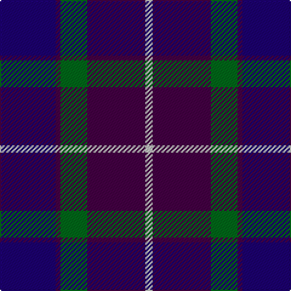

The parent of this is [Scottish Open Squash (Corporate)](/tartans/db/46/dp4/g22/dp48/n/6/)

This was sourced from tartans-authority.  It is a [5 stripes tartan](/stripes/stripes5/).

Original link http://www.tartansauthority.com/tartan-ferret/display/3189/

## Thread count
DB/46 DP4 G22 DP48 N/6

## Palette
Each colour and its ΔE from the base-6 reference it is a variant of.

| Colour | Shade | Base | ΔE (OKLab) |
|---|---|---|---|
| DB |  `#1C0070` | B  | 0.14 |
| DP |  `#440044` | B  | 0.17 |
| G |  `#006818` | G  | 0.02 |
| N |  `#C0C0C0` | W  | 0.16 |

# Sample pattern

ID: /variants/db/46/dp4/g22/dp48/n/6-db1c0070-dp440044-g006818-nc0c0c0/
