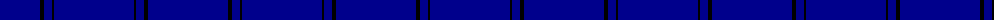

The parent of this is [Loevenstein Castle 3 (Artefact)](/tartans/db/48/dba16/k4/db8/k2/dba/80/)

This was sourced from tartans-authority.  It is a [6 stripes tartan](/stripes/stripes6/).

Original link http://www.tartansauthority.com/tartan-ferret/display/3632/

## Thread count
DB/48 DBa16 K4 DB8 K2 DBa/80

## Palette
Each colour and its ΔE from the base-6 reference it is a variant of.

| Colour | Shade | Base | ΔE (OKLab) |
|---|---|---|---|
| DB |  `#00008C` | B  | 0.13 |
| DBa |  `#00008C` | B  | 0.13 |
| K |  `#000000` | K  | 0.00 |

# Sample pattern

ID: /variants/db/48/dba16/k4/db8/k2/dba/80-db00008c-dba00008c-k000000/
