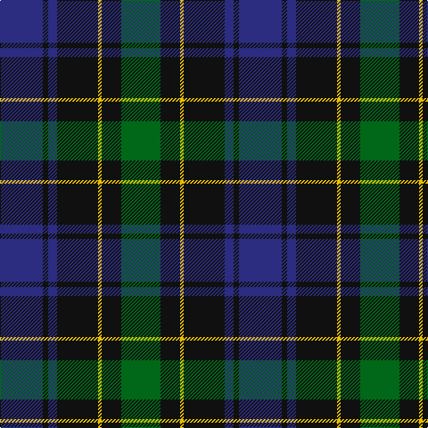

The parent of this is [Mowat (Clans Originaux)](/tartans/db/48/k6/db10/k46/y4/k22/g/44/)

This was sourced from register-of-tartans.  It is a [7 stripes tartan](/stripes/stripes7/).

Original link https://www.tartanregister.gov.uk/tartanDetails.aspx?ref=3035

## Thread count
DB/48 K6 DB10 K46 Y4 K22 G/44

## Palette
Each colour and its ΔE from the base-6 reference it is a variant of.

| Colour | Shade | Base | ΔE (OKLab) |
|---|---|---|---|
| DB |  `#2C2C80` | B  | 0.05 |
| G |  `#006818` | G  | 0.02 |
| K |  `#101010` | K  | 0.17 |
| Y |  `#E8C000` | Y  | 0.00 |

# Sample pattern

ID: /variants/db/48/k6/db10/k46/y4/k22/g/44-db2c2c80-g006818-k101010-ye8c000/
