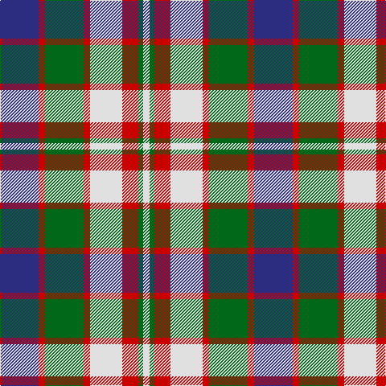

The parent of this is [Robertson Dress (Dalgleish) #2](/tartans/db/48/r8/g48/r8/ln40/r20/g6/ln/8/)

This was sourced from register-of-tartans.  It is a [8 stripes tartan](/stripes/stripes8/).

Original link https://www.tartanregister.gov.uk/tartanDetails.aspx?ref=3530

## Thread count
DB/48 R8 G48 R8 LN40 R20 G6 LN/8

## Palette
Each colour and its ΔE from the base-6 reference it is a variant of.

| Colour | Shade | Base | ΔE (OKLab) |
|---|---|---|---|
| DB |  `#2C2C80` | B  | 0.05 |
| G |  `#006818` | G  | 0.02 |
| LN |  `#E0E0E0` | W  | 0.06 |
| R |  `#C80000` | R  | 0.00 |

# Sample pattern

ID: /variants/db/48/r8/g48/r8/ln40/r20/g6/ln/8-db2c2c80-g006818-lne0e0e0-rc80000/
