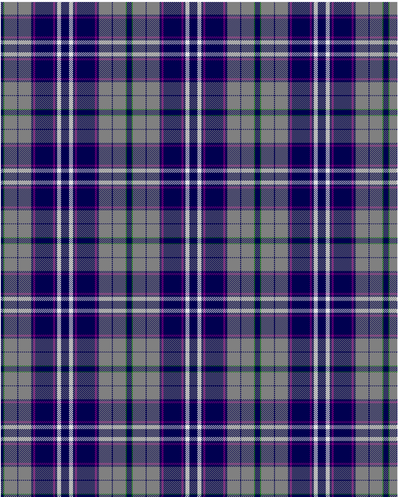

Historic Scotland

This was sourced from <no value>.  It is a 12 stripes tartan.

Original link http://www.weddslist.com/cgi-bin/tartans/pg.pl?source=sts

## Thread count
DB/5 G2 N26 DB2 N26 DB4 P4 DB36 P4 DB4 LN8 DB/8

## Palette
DB#000050 G#008000 LN#E0E0E0 N#808080 P#800080

# Sample pattern

ID: /variants/db/5/g2/n26/db2/n26/db4/p4/db36/p4/db4/ln8/db/8-db000050-g008000-lne0e0e0-n808080-p800080