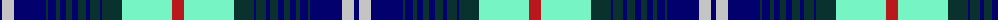

The parent of this is [Help for Heroes Corporate Tartan Tartan Number: 10561. Earliest known date: 20/01/2012 The use of the tartan is restricted in line with a legal agreement between Help for Heroes and Lochcarron of Scotland. Woven by Lochcarron of Scotland This tartan was inspired by William McGregor and George Neil of G B Tailoring, and has been produced to raise funds for Help for Heroes. The colours represent the UK Army, Navy and Airforce See products available Copyright © Blair Urquhart, Comrie, 2015](/tartans/db/5/n12/db32/dg2/db8/dg4/db6/dg6/db6/dg8/db4/dg10/db2/dg20/lb50/r/12/)

This was sourced from house-of-tartan.  It is a [16 stripes tartan](/stripes/stripes16/).

Original link http://www.house-of-tartan.scotland.net/house/TartanViewjs.asp?colr=Def&tnam=10561

## Thread count
DB/5 N12 DB32 DG2 DB8 DG4 DB6 DG6 DB6 DG8 DB4 DG10 DB2 DG20 LB50 R/12

## Palette
Each colour and its ΔE from the base-6 reference it is a variant of.

| Colour | Shade | Base | ΔE (OKLab) |
|---|---|---|---|
| DB |  `#01006C` | B  | 0.16 |
| DG |  `#09322E` | B  | 0.16 |
| LB |  `#76F4C4` | W  | 0.15 |
| N |  `#C4C4C4` | W  | 0.15 |
| R |  `#B9181D` | R  | 0.03 |

ID: /variants/db/5/n12/db32/dg2/db8/dg4/db6/dg6/db6/dg8/db4/dg10/db2/dg20/lb50/r/12-db01006c-dg09322e-lb76f4c4-nc4c4c4-rb9181d/
