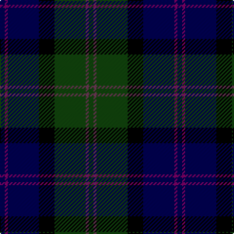

The parent of this is [MacThomas LC](/tartans/db/5/p3/db32/k16/dg32/n3/dg/5/)

This was sourced from weddslist.  It is a [7 stripes tartan](/stripes/stripes7/).

Original link http://www.weddslist.com/cgi-bin/tartans/pg.pl?source=x

## Thread count
DB/5 P3 DB32 K16 DG32 N3 DG/5

## Palette
Each colour and its ΔE from the base-6 reference it is a variant of.

| Colour | Shade | Base | ΔE (OKLab) |
|---|---|---|---|
| DB |  `#000052` | B  | 0.20 |
| DG |  `#11450D` | G  | 0.10 |
| K |  `#000000` | K  | 0.00 |
| N |  `#6D3855` | B  | 0.13 |
| P |  `#7F0066` | B  | 0.18 |

# Sample pattern

ID: /variants/db/5/p3/db32/k16/dg32/n3/dg/5-db000052-dg11450d-k000000-n6d3855-p7f0066/
