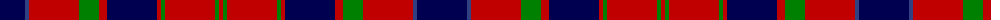

The parent of this is [Hebridean 5](/tartans/db/50/b4/r50/g20/r8/db50/r4/g4/r50/g4/r/4/)

This was sourced from weddslist.  It is a [11 stripes tartan](/stripes/stripes11/).

Original link http://www.weddslist.com/cgi-bin/tartans/pg.pl?source=sts

## Thread count
DB/50 B4 R50 G20 R8 DB50 R4 G4 R50 G4 R/4

## Palette
Each colour and its ΔE from the base-6 reference it is a variant of.

| Colour | Shade | Base | ΔE (OKLab) |
|---|---|---|---|
| B |  `#304080` | B  | 0.01 |
| DB |  `#000050` | B  | 0.20 |
| G |  `#008000` | G  | 0.09 |
| R |  `#C00000` | R  | 0.02 |

ID: /variants/db/50/b4/r50/g20/r8/db50/r4/g4/r50/g4/r/4-b304080-db000050-g008000-rc00000/
