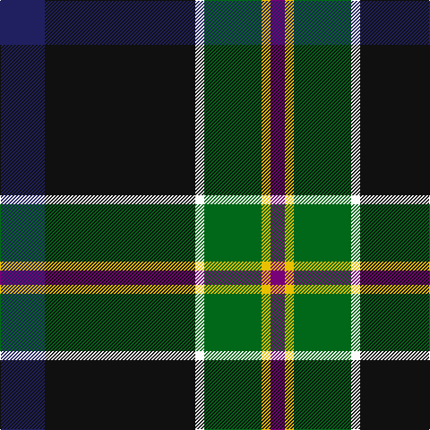

The parent of this is [Woodward, R Glenn](/tartans/db/50/k168/w10/g64/y10/p/16/)

This was sourced from tartans-authority.  It is a [6 stripes tartan](/stripes/stripes6/).

Original link http://www.tartansauthority.com/tartan-ferret/display/10877/

## Thread count
DB/50 K168 W10 G64 Y10 P/16

## Palette
Each colour and its ΔE from the base-6 reference it is a variant of.

| Colour | Shade | Base | ΔE (OKLab) |
|---|---|---|---|
| DB |  `#202060` | B  | 0.11 |
| G |  `#006818` | G  | 0.02 |
| K |  `#101010` | K  | 0.17 |
| P |  `#780078` | B  | 0.16 |
| W |  `#FCFCFC` | W  | 0.03 |
| Y |  `#E8C000` | Y  | 0.00 |

# Sample pattern

ID: /variants/db/50/k168/w10/g64/y10/p/16-db202060-g006818-k101010-p780078-wfcfcfc-ye8c000/
