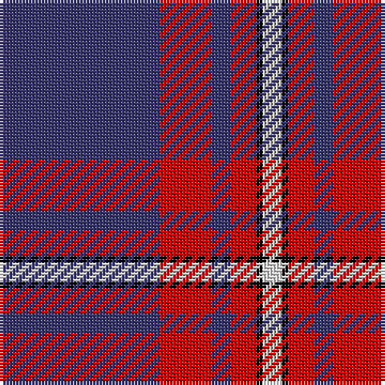

The parent of this is [Clan Gregor Tartan Tartan Number: 3089. Earliest known date: See products available Copyright © Blair Urquhart, Comrie, 2015](/tartans/db/50/r16/db6/r8/k2/ln/6/)

This was sourced from house-of-tartan.  It is a [6 stripes tartan](/stripes/stripes6/).

Original link http://www.house-of-tartan.scotland.net/house/TartanViewjs.asp?colr=Def&tnam=3089

## Thread count
DB/50 R16 DB6 R8 K2 LN/6

## Palette
Each colour and its ΔE from the base-6 reference it is a variant of.

| Colour | Shade | Base | ΔE (OKLab) |
|---|---|---|---|
| DB |  `#38356A` | B  | 0.05 |
| K |  `#080808` | K  | 0.13 |
| LN |  `#E0E0E0` | W  | 0.06 |
| R |  `#C80000` | R  | 0.00 |

# Sample pattern

ID: /variants/db/50/r16/db6/r8/k2/ln/6-db38356a-k080808-lne0e0e0-rc80000/
