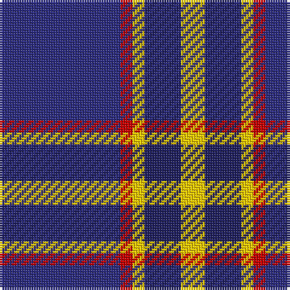

The parent of this is [Lytley Hunting (Personal)](/tartans/db/50/r5/y5/dba15/y/10/)

This was sourced from tartans-authority.  It is a [5 stripes tartan](/stripes/stripes5/).

Original link http://www.tartansauthority.com/tartan-ferret/display/10477/

## Thread count
DB/50 R5 Y5 DBa15 Y/10

## Palette
Each colour and its ΔE from the base-6 reference it is a variant of.

| Colour | Shade | Base | ΔE (OKLab) |
|---|---|---|---|
| DB |  `#2C2C80` | B  | 0.05 |
| DBa |  `#202060` | B  | 0.11 |
| R |  `#C80000` | R  | 0.00 |
| Y |  `#FCCC00` | Y  | 0.04 |

# Sample pattern

ID: /variants/db/50/r5/y5/dba15/y/10-db2c2c80-dba202060-rc80000-yfccc00/
