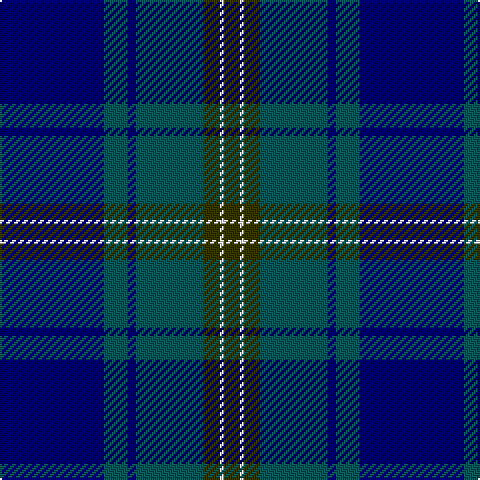

The parent of this is [Doral (Fashion)](/tartans/db/52/g12/db4/g34/t8/w2/t/8/)

This was sourced from tartans-authority.  It is a [7 stripes tartan](/stripes/stripes7/).

Original link http://www.tartansauthority.com/tartan-ferret/display/4691/

## Thread count
DB/52 G12 DB4 G34 T8 W2 T/8

## Palette
Each colour and its ΔE from the base-6 reference it is a variant of.

| Colour | Shade | Base | ΔE (OKLab) |
|---|---|---|---|
| DB |  `#000064` | B  | 0.17 |
| G |  `#0C5454` | B  | 0.12 |
| T |  `#343400` | G  | 0.16 |
| W |  `#FCFCFC` | W  | 0.03 |

# Sample pattern

ID: /variants/db/52/g12/db4/g34/t8/w2/t/8-db000064-g0c5454-t343400-wfcfcfc/
