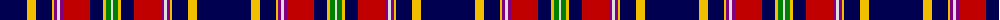

The parent of this is [Queens University, of Ontario](/tartans/db/54/y9/db16/y2/p3/ln3/p3/r27/db13/y3/g5/ln/2/)

This was sourced from weddslist.  It is a [12 stripes tartan](/stripes/stripes12/).

Original link http://www.weddslist.com/cgi-bin/tartans/pg.pl?source=sts

## Thread count
DB/54 Y9 DB16 Y2 P3 LN3 P3 R27 DB13 Y3 G5 LN/2

## Palette
Each colour and its ΔE from the base-6 reference it is a variant of.

| Colour | Shade | Base | ΔE (OKLab) |
|---|---|---|---|
| DB |  `#000050` | B  | 0.20 |
| G |  `#008000` | G  | 0.09 |
| LN |  `#E0E0E0` | W  | 0.06 |
| P |  `#800080` | B  | 0.17 |
| R |  `#C00000` | R  | 0.02 |
| Y |  `#F0C000` | Y  | 0.01 |

ID: /variants/db/54/y9/db16/y2/p3/ln3/p3/r27/db13/y3/g5/ln/2-db000050-g008000-lne0e0e0-p800080-rc00000-yf0c000/
