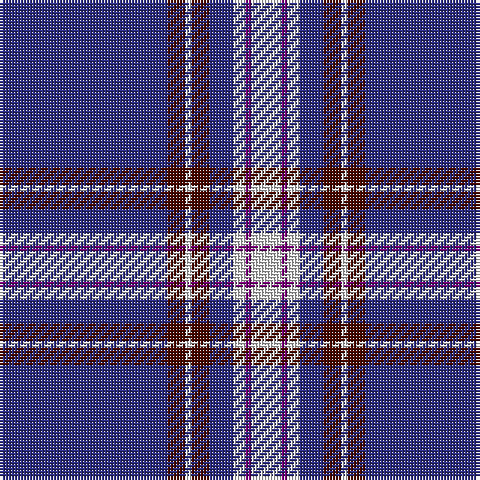

The parent of this is [Baker Family Tartan Tartan Number: 613. Earliest known date: pre 2003 STS notes 'Sample in trade specimens file.' See products available Copyright © Blair Urquhart, Comrie, 2015](/tartans/db/56/dr6/ln2/dr6/db8/ln4/p2/ln/10/)

This was sourced from house-of-tartan.  It is a [8 stripes tartan](/stripes/stripes8/).

Original link http://www.house-of-tartan.scotland.net/house/TartanViewjs.asp?colr=Def&tnam=613

## Thread count
DB/56 DR6 LN2 DR6 DB8 LN4 P2 LN/10

## Palette
Each colour and its ΔE from the base-6 reference it is a variant of.

| Colour | Shade | Base | ΔE (OKLab) |
|---|---|---|---|
| DB |  `#2C2C80` | B  | 0.05 |
| DR |  `#480800` | B  | 0.23 |
| LN |  `#E0E0E0` | W  | 0.06 |
| P |  `#780078` | B  | 0.16 |

# Sample pattern

ID: /variants/db/56/dr6/ln2/dr6/db8/ln4/p2/ln/10-db2c2c80-dr480800-lne0e0e0-p780078/
