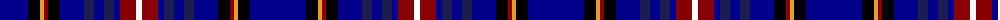

The parent of this is [Meirhaeghe, Van](/tartans/db/56/k12/y4/dr4/k12/db24/dba10/db10/dba10/db6/dr16/w/6/)

This was sourced from register-of-tartans.  It is a [12 stripes tartan](/stripes/stripes12/).

Original link https://www.tartanregister.gov.uk/tartanDetails.aspx?ref=11014

## Thread count
DB/56 K12 Y4 DR4 K12 DB24 DBa10 DB10 DBa10 DB6 DR16 W/6

## Palette
Each colour and its ΔE from the base-6 reference it is a variant of.

| Colour | Shade | Base | ΔE (OKLab) |
|---|---|---|---|
| DB |  `#00008C` | B  | 0.13 |
| DBa |  `#1C1C50` | B  | 0.14 |
| DR |  `#880000` | R  | 0.14 |
| K |  `#000000` | K  | 0.00 |
| W |  `#FFFFFF` | W  | 0.03 |
| Y |  `#E0A126` | Y  | 0.08 |

ID: /variants/db/56/k12/y4/dr4/k12/db24/dba10/db10/dba10/db6/dr16/w/6-db00008c-dba1c1c50-dr880000-k000000-wffffff-ye0a126/
