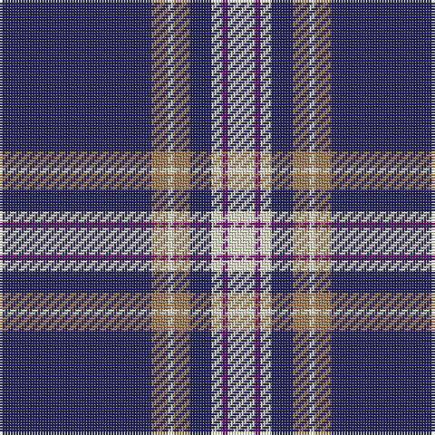

The parent of this is [Baker](/tartans/db/56/lt6/ly2/lt6/db8/ly4/p2/ly/10/)

This was sourced from register-of-tartans.  It is a [8 stripes tartan](/stripes/stripes8/).

Original link https://www.tartanregister.gov.uk/tartanDetails.aspx?ref=171

## Thread count
DB/56 LT6 LY2 LT6 DB8 LY4 P2 LY/10

## Palette
Each colour and its ΔE from the base-6 reference it is a variant of.

| Colour | Shade | Base | ΔE (OKLab) |
|---|---|---|---|
| DB |  `#202060` | B  | 0.11 |
| DR |  `#680028` | B  | 0.20 |
| DRa |  `#880000` | R  | 0.14 |
| LT |  `#A07C58` | R  | 0.19 |
| LY |  `#F8F4D0` | W  | 0.04 |
| P |  `#780078` | B  | 0.16 |
| T |  `#604000` | G  | 0.14 |

# Sample pattern

ID: /variants/db/56/lt6/ly2/lt6/db8/ly4/p2/ly/10-db202060-dr680028-dra880000-lta07c58-lyf8f4d0-p780078-t604000/
