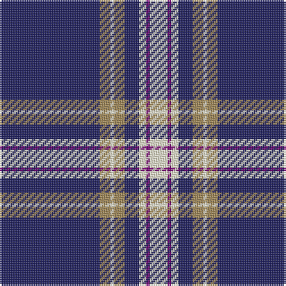

The parent of this is [Baker (Name)](/tartans/db/56/lt6/ly2/lt6/db8/ly4/p2/ly/10/)

This was sourced from tartans-authority.  It is a [8 stripes tartan](/stripes/stripes8/).

Original link http://www.tartansauthority.com/tartan-ferret/display/613/

## Thread count
DB/56 LT6 LY2 LT6 DB8 LY4 P2 LY/10

## Palette
Each colour and its ΔE from the base-6 reference it is a variant of.

| Colour | Shade | Base | ΔE (OKLab) |
|---|---|---|---|
| DB |  `#202060` | B  | 0.11 |
| LT |  `#A08858` | Y  | 0.21 |
| LY |  `#F8F4D0` | W  | 0.04 |
| P |  `#780078` | B  | 0.16 |

# Sample pattern

ID: /variants/db/56/lt6/ly2/lt6/db8/ly4/p2/ly/10-db202060-lta08858-lyf8f4d0-p780078/
