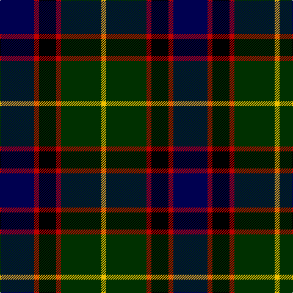

The parent of this is [Royal College of Physicians of Edinburgh](/tartans/db/56/r8/k28/r8/dg66/y/8/)

This was sourced from weddslist.  It is a [6 stripes tartan](/stripes/stripes6/).

Original link http://www.weddslist.com/cgi-bin/tartans/pg.pl?source=sts

## Thread count
DB/56 R8 K28 R8 DG66 Y/8

## Palette
Each colour and its ΔE from the base-6 reference it is a variant of.

| Colour | Shade | Base | ΔE (OKLab) |
|---|---|---|---|
| DB |  `#000050` | B  | 0.20 |
| DG |  `#003000` | G  | 0.18 |
| K |  `#000000` | K  | 0.00 |
| R |  `#C00000` | R  | 0.02 |
| Y |  `#F0C000` | Y  | 0.01 |

# Sample pattern

ID: /variants/db/56/r8/k28/r8/dg66/y/8-db000050-dg003000-k000000-rc00000-yf0c000/
