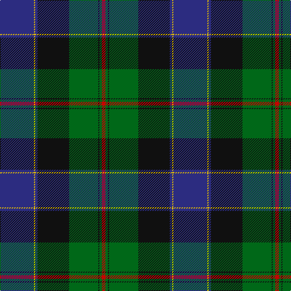

The parent of this is [Ogilvie of Inverquharity Clan Tartan Tartan Number: 666. Earliest known date: 1842 Adam No 97. The Setts No: 209. See products available Copyright © Blair Urquhart, Comrie, 2015](/tartans/db/56/y2/db4/k52/g48/k2/g4/r/6/)

This was sourced from house-of-tartan.  It is a [8 stripes tartan](/stripes/stripes8/).

Original link http://www.house-of-tartan.scotland.net/house/TartanViewjs.asp?colr=Def&tnam=666

## Thread count
DB/56 Y2 DB4 K52 G48 K2 G4 R/6

## Palette
Each colour and its ΔE from the base-6 reference it is a variant of.

| Colour | Shade | Base | ΔE (OKLab) |
|---|---|---|---|
| DB |  `#2C2C80` | B  | 0.05 |
| G |  `#006818` | G  | 0.02 |
| K |  `#101010` | K  | 0.17 |
| R |  `#C80000` | R  | 0.00 |
| Y |  `#E8C000` | Y  | 0.00 |

# Sample pattern

ID: /variants/db/56/y2/db4/k52/g48/k2/g4/r/6-db2c2c80-g006818-k101010-rc80000-ye8c000/
