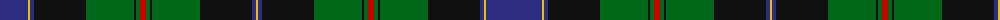

The parent of this is [Ogilvie of Inverarity (V.S.)](/tartans/db/56/y2/db4/k52/g48/k2/g4/r6/g4/k2/g48/k52/db4/y/2/)

This was sourced from register-of-tartans.  It is a [14 stripes tartan](/stripes/stripes14/).

Original link https://www.tartanregister.gov.uk/tartanDetails.aspx?ref=3232

## Thread count
DB/56 Y2 DB4 K52 G48 K2 G4 R6 G4 K2 G48 K52 DB4 Y/2

## Palette
Each colour and its ΔE from the base-6 reference it is a variant of.

| Colour | Shade | Base | ΔE (OKLab) |
|---|---|---|---|
| DB |  `#2C2C80` | B  | 0.05 |
| G |  `#006818` | G  | 0.02 |
| K |  `#101010` | K  | 0.17 |
| R |  `#C80000` | R  | 0.00 |
| Y |  `#E8C000` | Y  | 0.00 |

ID: /variants/db/56/y2/db4/k52/g48/k2/g4/r6/g4/k2/g48/k52/db4/y/2-db2c2c80-g006818-k101010-rc80000-ye8c000/
