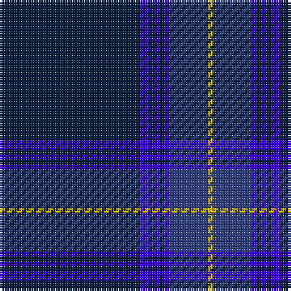

The parent of this is [Marist School, The](/tartans/db/58/b4/db2/b2/db2/b2/ba16/y/2/)

This was sourced from weddslist.  It is a [8 stripes tartan](/stripes/stripes8/).

Original link http://www.weddslist.com/cgi-bin/tartans/pg.pl?source=sts

## Thread count
DB/58 B4 DB2 B2 DB2 B2 Ba16 Y/2

## Palette
Each colour and its ΔE from the base-6 reference it is a variant of.

| Colour | Shade | Base | ΔE (OKLab) |
|---|---|---|---|
| B |  `#4000FF` | B  | 0.20 |
| Ba |  `#304080` | B  | 0.01 |
| DB |  `#102040` | B  | 0.15 |
| Y |  `#F0C000` | Y  | 0.01 |

# Sample pattern

ID: /variants/db/58/b4/db2/b2/db2/b2/ba16/y/2-b4000ff-ba304080-db102040-yf0c000/
