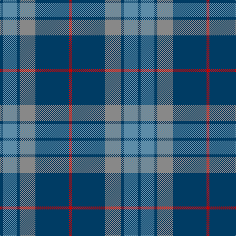

The parent of this is [Thorburn (Lochcarron)](/tartans/db/6/b28/db6/n32/db68/r/6/)

This was sourced from register-of-tartans.  It is a [6 stripes tartan](/stripes/stripes6/).

Original link https://www.tartanregister.gov.uk/tartanDetails.aspx?ref=4124

## Thread count
DB/6 B28 DB6 N32 DB68 R/6

## Palette
Each colour and its ΔE from the base-6 reference it is a variant of.

| Colour | Shade | Base | ΔE (OKLab) |
|---|---|---|---|
| B |  `#5C8CA8` | B  | 0.23 |
| DB |  `#003C64` | B  | 0.07 |
| N |  `#888888` | R  | 0.24 |
| R |  `#C80000` | R  | 0.00 |

# Sample pattern

ID: /variants/db/6/b28/db6/n32/db68/r/6-b5c8ca8-db003c64-n888888-rc80000/
