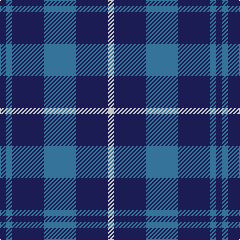

The parent of this is [Murray Taylor](/tartans/db/6/b6/db32/b32/db32/w/6/)

This was sourced from register-of-tartans.  It is a [6 stripes tartan](/stripes/stripes6/).

Original link https://www.tartanregister.gov.uk/tartanDetails.aspx?ref=11354

## Thread count
DB/6 B6 DB32 B32 DB32 W/6

## Palette
Each colour and its ΔE from the base-6 reference it is a variant of.

| Colour | Shade | Base | ΔE (OKLab) |
|---|---|---|---|
| B |  `#3C82AF` | B  | 0.20 |
| DB |  `#202060` | B  | 0.11 |
| W |  `#FFFFFF` | W  | 0.03 |

# Sample pattern

ID: /variants/db/6/b6/db32/b32/db32/w/6-b3c82af-db202060-wffffff/
