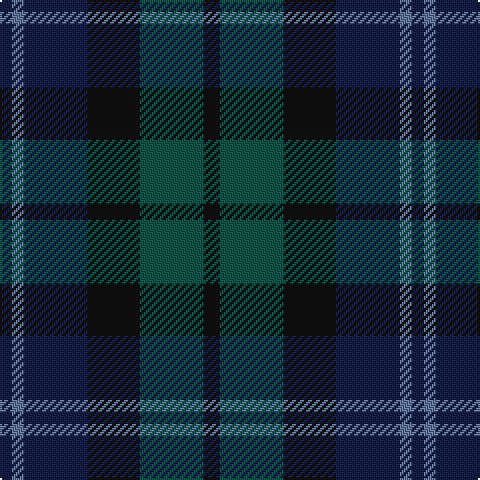

The parent of this is [I Y](/tartans/db/6/b6/db32/k26/g32/k/8/)

This was sourced from register-of-tartans.  It is a [6 stripes tartan](/stripes/stripes6/).

Original link https://www.tartanregister.gov.uk/tartanDetails.aspx?ref=11342

## Thread count
DB/6 B6 DB32 K26 G32 K/8

## Palette
Each colour and its ΔE from the base-6 reference it is a variant of.

| Colour | Shade | Base | ΔE (OKLab) |
|---|---|---|---|
| B |  `#5F749C` | B  | 0.17 |
| DB |  `#141E46` | B  | 0.15 |
| G |  `#005448` | G  | 0.11 |
| K |  `#101010` | K  | 0.17 |

# Sample pattern

ID: /variants/db/6/b6/db32/k26/g32/k/8-b5f749c-db141e46-g005448-k101010/
