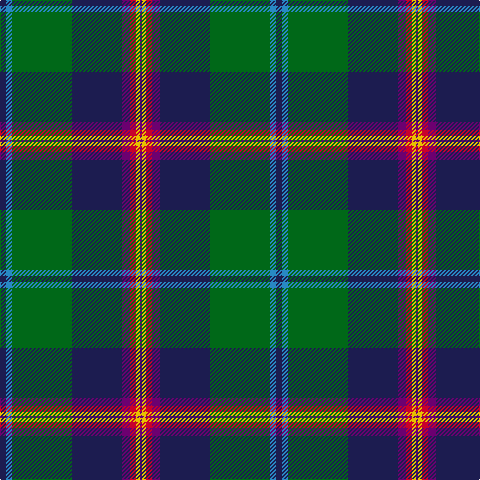

The parent of this is [Young](/tartans/db/6/b6/g60/db50/p8/ra6/y4/p/2/)

This was sourced from register-of-tartans.  It is a [8 stripes tartan](/stripes/stripes8/).

Original link https://www.tartanregister.gov.uk/tartanDetails.aspx?ref=4796

## Thread count
DB/6 B6 G60 DB50 P8 Ra6 Y4 P/2

## Palette
Each colour and its ΔE from the base-6 reference it is a variant of.

| Colour | Shade | Base | ΔE (OKLab) |
|---|---|---|---|
| B |  `#2888C4` | B  | 0.21 |
| DB |  `#1C1C50` | B  | 0.14 |
| G |  `#006818` | G  | 0.02 |
| LP |  `#C49CD8` | W  | 0.24 |
| O |  `#EC8048` | Y  | 0.17 |
| P |  `#6C0070` | B  | 0.15 |
| Pa |  `#701C60` | B  | 0.15 |
| Pb |  `#C04094` | R  | 0.17 |
| R |  `#CC4438` | R  | 0.07 |
| Ra |  `#C8002C` | R  | 0.03 |
| Y |  `#E8C000` | Y  | 0.00 |

# Sample pattern

ID: /variants/db/6/b6/g60/db50/p8/ra6/y4/p/2-b2888c4-db1c1c50-g006818-lpc49cd8-oec8048-p6c0070-pa701c60-pbc04094-rcc4438-rac8002c-ye8c000/
