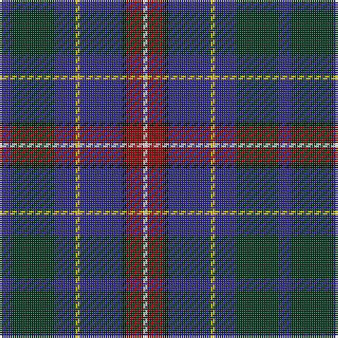

The parent of this is [Cot-Hach (Personal)l)](/tartans/db/6/dg20/db10/y2/db20/k2/dr8/w/2/)

This was sourced from tartans-authority.  It is a [8 stripes tartan](/stripes/stripes8/).

Original link http://www.tartansauthority.com/tartan-ferret/display/10993/

## Thread count
DB/6 DG20 DB10 Y2 DB20 K2 DR8 W/2

## Palette
Each colour and its ΔE from the base-6 reference it is a variant of.

| Colour | Shade | Base | ΔE (OKLab) |
|---|---|---|---|
| DB |  `#2C2C80` | B  | 0.05 |
| DG |  `#003820` | G  | 0.16 |
| DR |  `#880000` | R  | 0.14 |
| K |  `#101010` | K  | 0.17 |
| W |  `#FCFCFC` | W  | 0.03 |
| Y |  `#E8C000` | Y  | 0.00 |

# Sample pattern

ID: /variants/db/6/dg20/db10/y2/db20/k2/dr8/w/2-db2c2c80-dg003820-dr880000-k101010-wfcfcfc-ye8c000/
