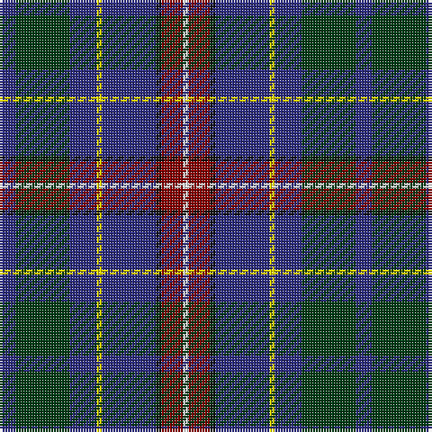

The parent of this is [Côté-Haché (Personal)](/tartans/db/6/dg20/db10/y2/db20/k2/dr8/w/2/)

This was sourced from register-of-tartans.  It is a [8 stripes tartan](/stripes/stripes8/).

Original link https://www.tartanregister.gov.uk/tartanDetails.aspx?ref=10993

## Thread count
DB/6 DG20 DB10 Y2 DB20 K2 DR8 W/2

## Palette
Each colour and its ΔE from the base-6 reference it is a variant of.

| Colour | Shade | Base | ΔE (OKLab) |
|---|---|---|---|
| DB |  `#2C2C80` | B  | 0.05 |
| DG |  `#003C14` | G  | 0.14 |
| DR |  `#880000` | R  | 0.14 |
| K |  `#101010` | K  | 0.17 |
| W |  `#FFFFFF` | W  | 0.03 |
| Y |  `#FFE600` | Y  | 0.10 |

# Sample pattern

ID: /variants/db/6/dg20/db10/y2/db20/k2/dr8/w/2-db2c2c80-dg003c14-dr880000-k101010-wffffff-yffe600/
